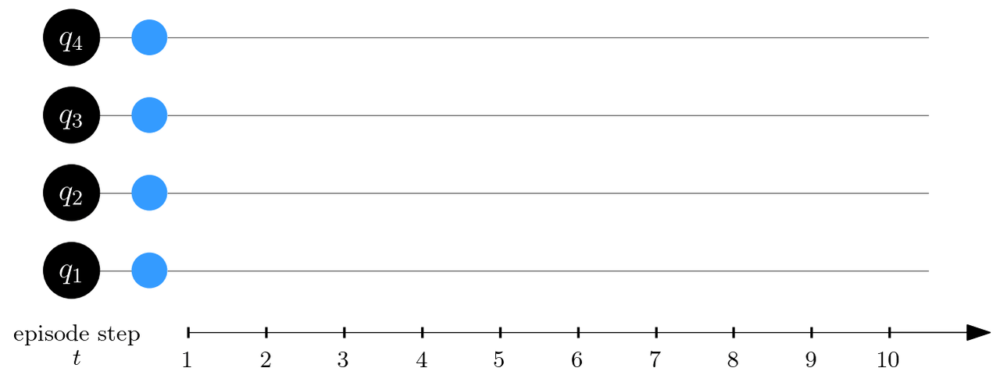

[](https://mybinder.org/v2/gh/mgbukov/RL_disentangle/HEAD)
# RL disentangle



### 1. Overview
***
This repository contains the source code from the paper "Reinforcement
Learning to Disentangle Multiqubit Quantum States from Partial Observations",
and a demo of the 4q and 5q RL agents in a form of interactive Jupyter Notebook.


### 2. Structure
***
* **interactive-demo.ipynb**<br>
  The interactive Jupyter Notebook that shows the 4q and 5q agents

* **`agents/`**<br>
 Contains the trained agents, ready for inference.
 Each agent is represented only by it's policy network, stored as a PyTorch
 statedict file and a JSON config with the correct parameters needed to instantiate it.

* **`configs/`**<br>
  Contains YAML configs for training of 12q and 16q agents

* **`data/`**<br>
  Contains accuracy stats for the RL agents in JSON format. These stats are
  used to generate the figures in the paper.

* **`logs/`**<br>
  This directory contains the text logs, various plots and checkpointed agents
  from the RL training.

* **`qiskit/`**<br>
   Contains interface code for NISQ devices

* **`scripts/`**<br>
   Contains Python & Bash scripts + Sample code

* **`src/`**<br>
    Contains the source code

* **`tests/`**<br>
    Contains tests

### 3. How to Use?
***
1. Clone the repo
2. Create Conda environment with dependent packages using `conda env create -f environment.yaml`
3. Check the demo script in `scripts/inference_demo.py` and the Interative Notebook `demo.ipynb`

Essentially you must instantiate the RL environment, load the agent's policy network
and then do a rollout. The snippet bellow shows a use case for 5 qubits system:

```python:
# Instantiate an RL environment.
env = QEnv(5, 1, obs_fn='rdm2m')
env.reset()

# Set the environment's state (assuming that `state` is a NumPy
# array that holds the quantum state we want to disentangle)
shape = (2,) * num_qubits
env.set_states(np.expand_dims(state.reshape(shape), 0))

# Load the agent
with open("agents/5q-policy-config.json", mode='rt') as f:
  policy_config = json.load(f)
policy = TransformerPE_2qRDM(
  in_dim=env.single_observation_space.shape[1],
  embed_dim=policy_config["embed_dim"],
  dim_mlp=policy_config["dim_mlp"],
  n_heads=policy_config["attn_heads"],
  n_layers=policy_config["transformer_layers"]
)
state_dict = torch.load("agents/5q-policy-statedict.pt")
policy.load_state_dict(state_dict)
policy.eval()

# Do a rollout
trajectory = []
success = False
with torch.no_grad():
  for _ in range(100):
      observation = env.obs_fn(env.simulator.states)
      logits = policy(observation)[0]
      probs = Categorical(logits=logits).probs
      a = np.argmax(probs.numpy())
      trajectory.append(env.actions[a])
      o, r, t, tr, i = env.step([a], reset=False)
      if torch.all(t):
          success = True
          break

# The selected actions are in `trajectory`
```


### 4. How to Train the Agents?
***
Check & run the script `train_gpu.py` with an argument a YAML config file.
The format of the YAML config is defined in `src/config.py`.
Example configs can be found in `configs/` (for 12q and 16q).

The approximate training times for different system sizes $L$ are:

| Number of qubits $L$ | Training time |
| --- | --- |
| 4 | 0.5 hours |
| 5 | 10 hours |
| 6 | 60 hours |
| 12 | 320 hours |
| 16 | 390 hours |

 We've used NVIDIA Tesla T4 GPU for $L\leq 6$ and NVIDIA 4070 Ti Super GPU for $L\geq 12$